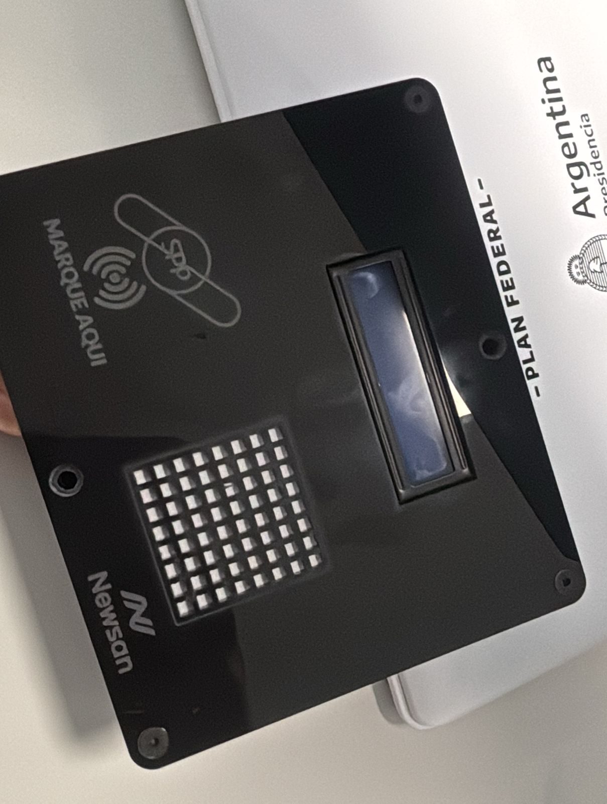

<h1>ArchiRFID</h1>

Este proyecto se enfoca en la lectura de tarjetas RFID de 125 kHz, una tecnología que permite la identificación de personas y ofrece la posibilidad de monitorear puestos de trabajo, optimizando la gestión de recursos y mejorando la seguridad en diversos entornos.
<h2>ArchiRFID V1.0</h2>

<h2>ArchiRFID V2.0</h2>

<h2>Descripción del proyecto</h2>

El sistema está diseñado para la adquisición de datos de las tarjetas RFID a través del puerto serial. Una vez capturada la información, esta puede adaptarse a diversas aplicaciones. En nuestro caso, hemos implementado el sistema para identificar y validar la presencia de personal autorizado en puestos de trabajo específicos, garantizando un control de trazabilidad de los equipos.

<h2>Especificaciónes técnicas </h2>

El funcionamiento de un sistema RFID es un proceso directo. El módulo RFID emite una frecuencia portadora de 125 kHz. Cuando una tarjeta RFID se aproxima al módulo, se establece una interacción entre la bobina del dispositivo y la tarjeta. Esta interacción crea un campo magnético que energiza la tarjeta, permitiendo que su chip interno responda. Al activarse, se emite una señal que contiene información codificada.

La señal emitida es analógica y modulada, siendo recibida por el integrado interno (U2270B) del lector RFID a través de su antena. Este integrado convierte la señal en datos digitales utilizando la codificación Manchester. Posteriormente, el microcontrolador decodifica la señal, basándose en un tiempo de espera para interpretar la señal correctamente. Una vez completada la decodificación, se extraen los bits necesarios para interpretar el número de la tarjeta.

Las tarjetas que se utilizan en este proyecto son de 39 bits, compuestos por 15 bits de paridad y 24 bits de datos, que corresponden al número de la tarjeta. El microcontrolador traduce la señal en paquetes y convierte los datos de binario a hexadecimal.

Según el datasheet del U2270B, existen diversas configuraciones que dependen del rango de detección del lector. Para cada una de estas configuraciones, es importante tener en cuenta que la salida (Pin 2) del integrado es de tipo colector abierto, lo que requiere una resistencia pull-up conectada a la fuente de alimentación (ya sea de 5V o 3.3V, según el microcontrolador utilizado). Para alimentacion externa se utilizó el modulo regulable LM317.

<h2>Esquema de conexión</h2>

A continuación, se presenta el esquema de conexiones. En este caso, estamos utilizando GP18 (RFID_OUT) para llevar a cabo la decodificación Manchester.

<h2>Link Útiles</h2>

- [Archi](https://archikids.com.ar/)
- [Datasheet U2270B](https://www.farnell.com/datasheets/94393.pdf)
